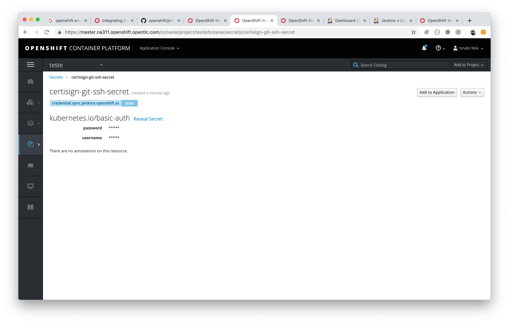
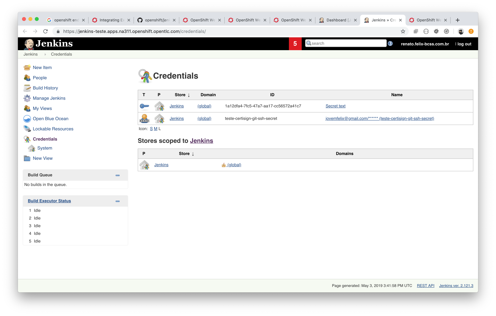
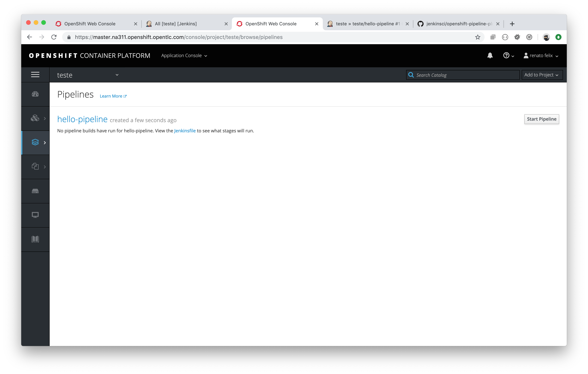
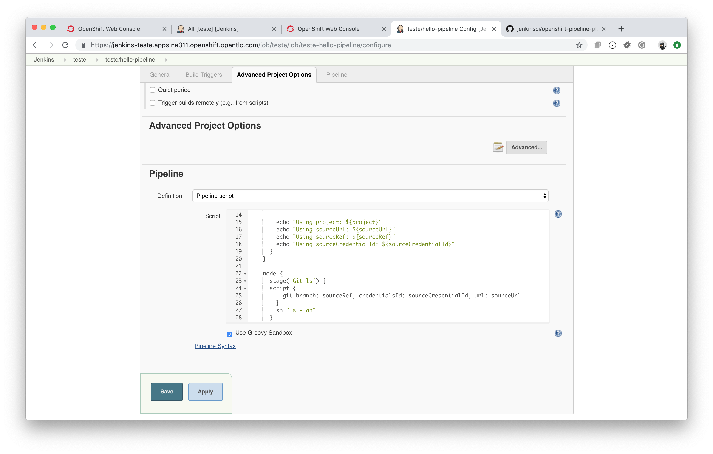
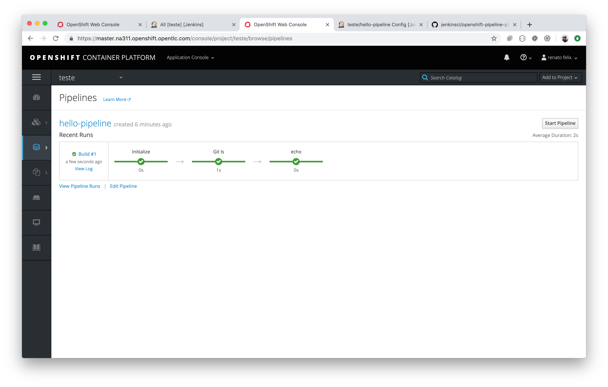
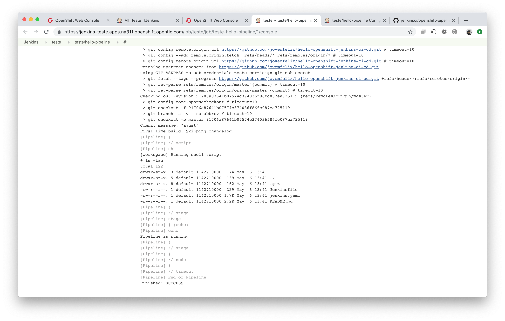

## Cria configuração Secret

```shell
$ oc create secret generic certisign-git-ssh-secret \
    --from-literal=username=<user_name> \
    --from-literal=password=<password> \
    --type=kubernetes.io/basic-auth
    
# habilitar syncronismo com jenkins
$ oc label secret certisign-git-ssh-secret credential.sync.jenkins.openshift.io=true

$ oc label secret certisign-git-ssh-secret jenkins.openshift.io/secret.name=certisign-git-ssh-secret
```


### Screen






## Criar template Jenkins

```
oc process -f jenkins-sync-secret.yml -p APPLICATION_NAME=hello | oc create -f -
```







### Iniciar o Build

```shell
# verificar o nome do build
$ oc get bc
NAME             TYPE              FROM      LATEST
hello-pipeline   JenkinsPipeline             0

# iniciar
$ oc start-build hello-pipeline
build.build.openshift.io/hello-pipeline-1 started
```




```shell
# vejas os logs
$ oc logs -f bc/hello-pipeline
info: logs available at /https://jenkins-teste.apps.na311.openshift.opentlc.com/blue/organizations/jenkins/teste%2Fteste-hello-pipeline/detail/teste-hello-pipeline/1/
```



## Referência

- https://github.com/openshift/jenkins-sync-plugin
- https://docs.openshift.com/container-platform/3.11/dev_guide/builds/build_inputs.html